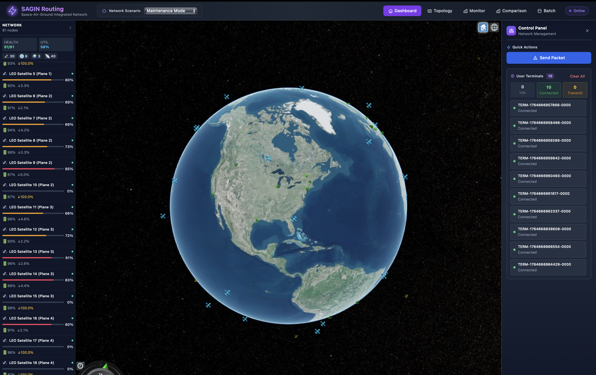
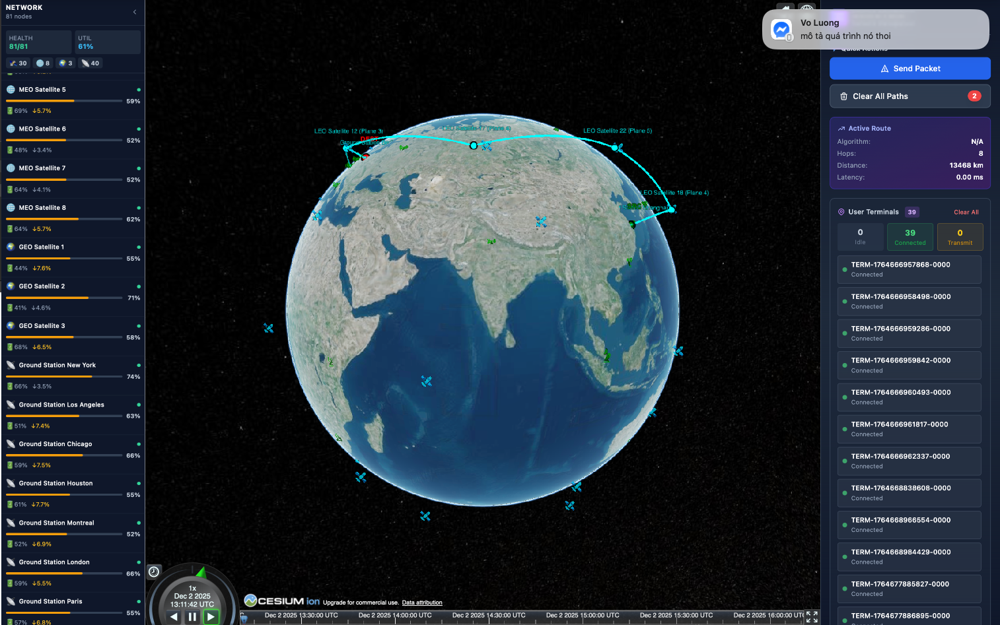
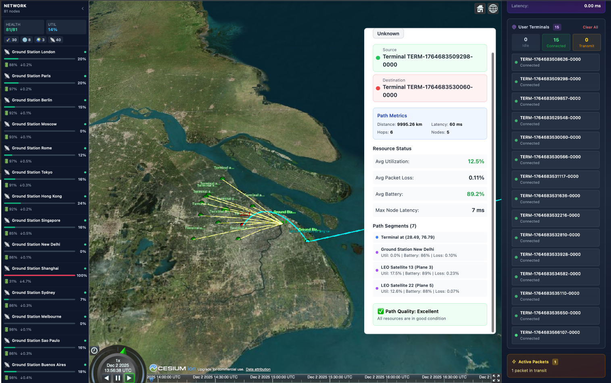
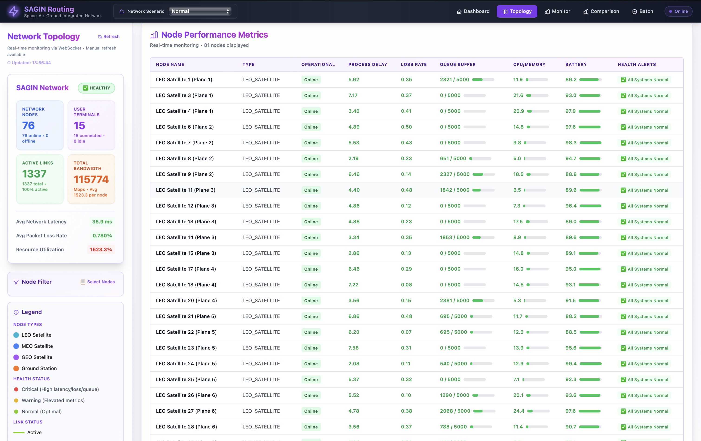
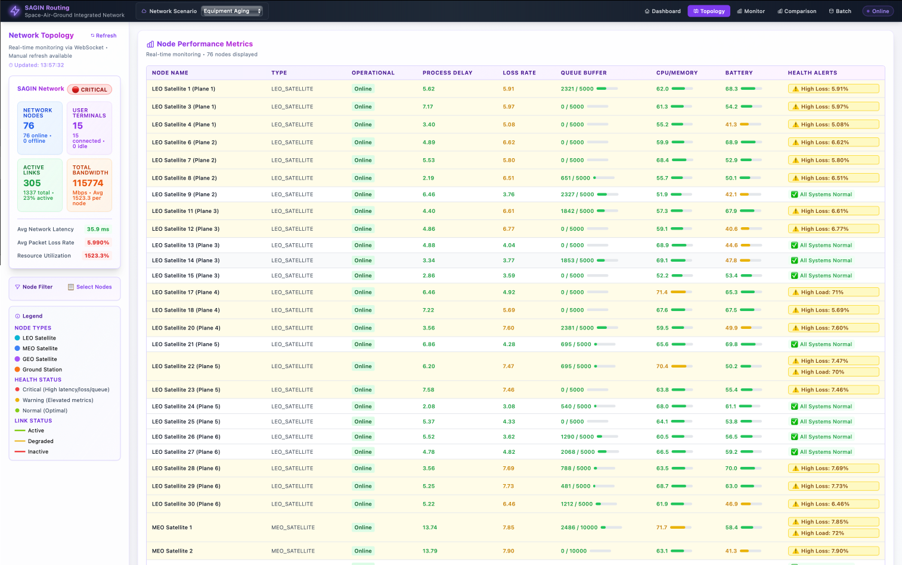
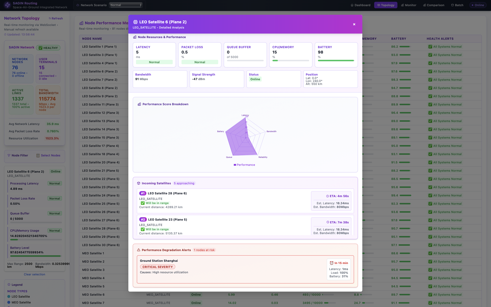
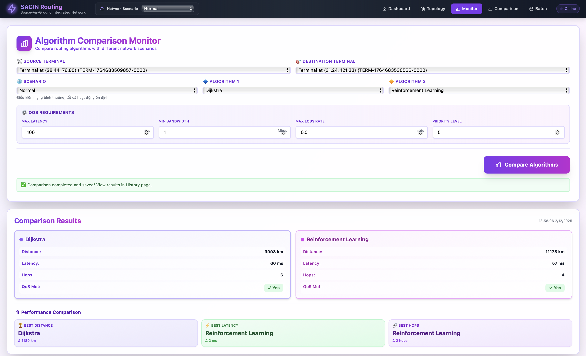
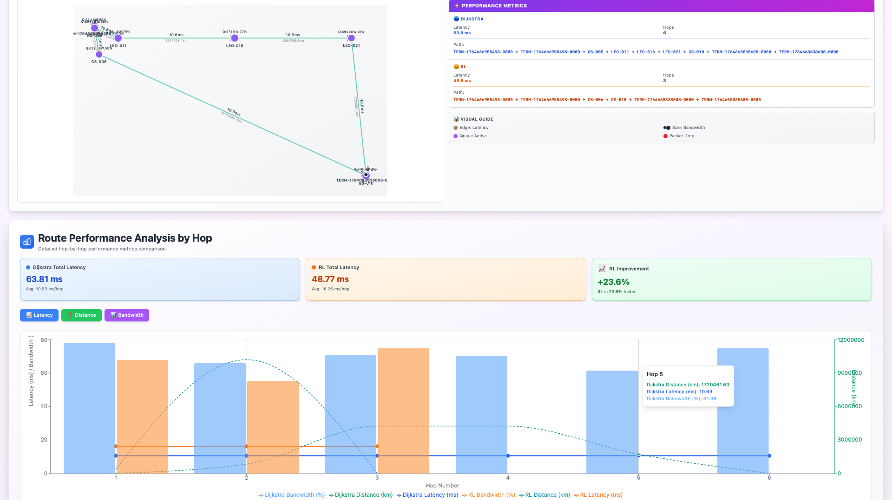
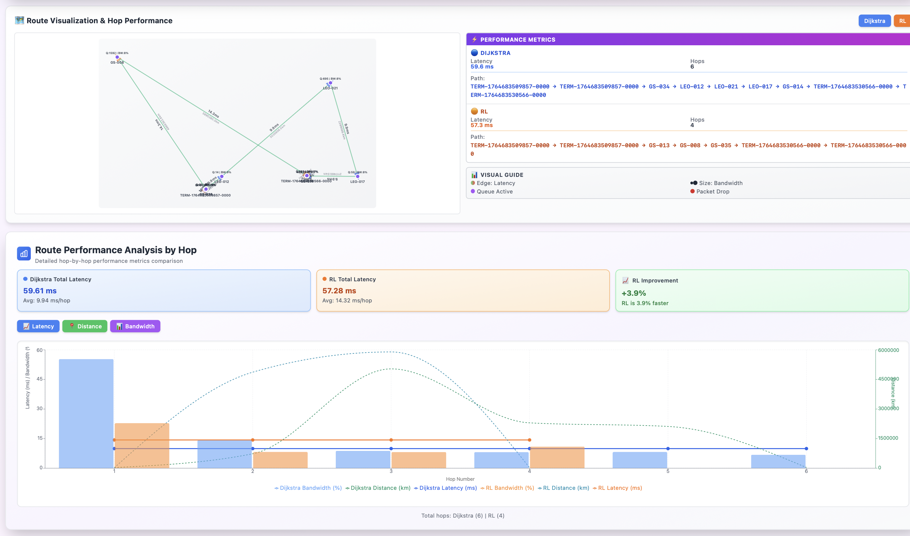
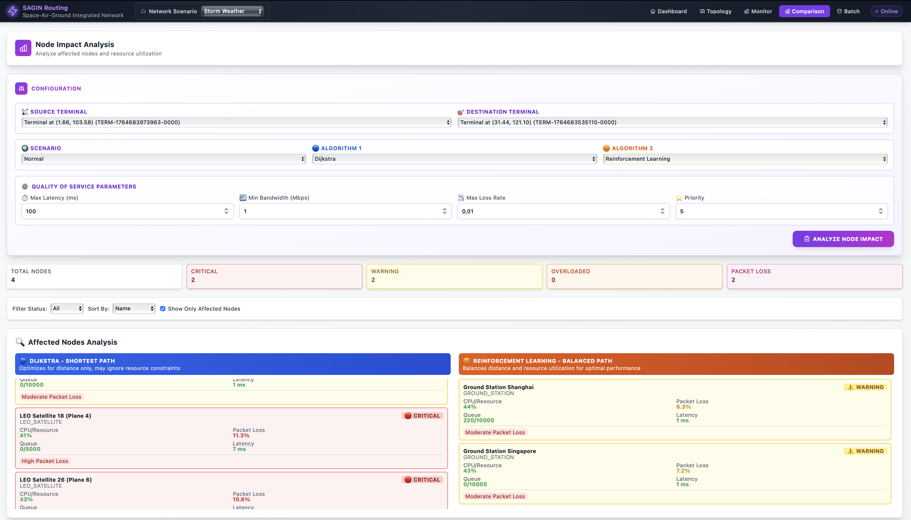

<p align="center" style="display: flex; justify-content: center; align-items: center; flex-wrap: wrap; gap: 15px;">
  
  
  
  
</p>

# SAGIN Routing System with Reinforcement Learning

A **Deep Reinforcement Learning-based routing system** for optimizing routing in **Space-Air-Ground Integrated Networks (SAGINs)** using **Dueling Deep Q-Networks (Dueling DQN)**, **Curriculum Learning**, and **Imitation Learning (DAGGER)**.

> Developed by **TheElite** for
>
> <h4 align="center">
>   <a href="#" target="_blank">
>     Project-Based Learning 4 (PBL4) – DUT
>   </a>
> </h4>

---

## Quick Start

```bash
# Clone the repository
git clone https://github.com/hnagnurtme/AI-PRACNS

# Navigate to the project directory
cd AI-PRACNS

# Start MongoDB
docker compose up -d mongodb

# Install Backend dependencies
cd Backend
pip install -r requirements.txt

# Configure environment
cp config.dev.yaml config.yaml
# Edit config.yaml with your settings

# Initialize database
python init_database.py

# Train the model
python -m training.train

# Start Backend API
python app.py

# Start Frontend (in another terminal)
cd Frontend
npm install
npm run dev
```

**What's included:**
- Frontend → http://localhost:3000
- Backend API → http://localhost:8080
- MongoDB → mongodb://localhost:27017
- TensorBoard → http://localhost:6006

**📖 Full training guide:** See [DEVELOPMENT.md](docs/DEVELOPMENT.md)

---

## Key Features

### Reinforcement Learning
- **Dueling DQN** for dynamic and optimal routing
- **Curriculum Learning** trains from easy to hard scenarios
- **Imitation Learning (DAGGER)** learns from expert demonstrations
- **Multi-objective Optimization** balances latency, reliability, and energy

### Network Simulation
- **Dynamic Topology** simulates realistic satellite movement
- **Multi-scenario Testing** includes normal, congestion, and failure scenarios
- **QoS-aware Routing** meets latency and reliability requirements

### Visualization
- **3D Globe** displays network topology with Cesium
- **Real-time Monitoring** tracks packet routing and metrics
- **TensorBoard Integration** visualizes training progress


## 📸 Screenshots

### Home Dashboard
<p align="center">
  
  <br/>
  <em>3D visualization of SAGIN network topology with satellites, ground stations, and UAVs</em>
</p>

### Routing Path Visualization
<p align="center">
  
  <br/>
  <em>Real-time routing path visualization showing packet transmission through network nodes</em>
</p>

### Congestion Optimization in Routing Networks
<p align="center">
  
  <br/>
  <em>Analysis of congestion levels and the effectiveness of optimization strategies in reducing network bottlenecks.
</em>
</p>

### Network Topology Parameters Visualization
<p align="center">
  
  <br/>
  <em>Visualization of SAGIN topology parameters including node distribution, connectivity structure, inter-layer links, and spatial layout</em>
</p>


### Real-time Monitoring
<p align="center">
  
  <br/>
  <em>Real-time network monitoring with performance metrics and alerts</em>
</p>

### Predictive Node & Link Status
<p align="center">
  
  <br/>
  <em>AI-based prediction of node health, upcoming satellite trajectories, and estimated future link quality</em>
</p>

### Performance Comparison Analysis
<p align="center">
  
  <br/>
  <em>Detailed assessment of latency, throughput, link stress, and congestion-handling efficiency across multiple routing approaches in dynamic SAGIN scenarios.</em>
</p>


### Performance Comparison
<p align="center">
  
  <br/>
  <em>Direct performance comparison between the RL-based routing agent and classical methods such as Dijkstra and heuristic routing.</em>
</p>


### Path Analysis
<p align="center">
  
  <br/>
  <em>Visualization of selected routing paths, showing how the RL agent adapts to topology changes and link variability.</em>
</p>


### System Logs
<p align="center">
  
  <br/>
  <em>System activity logs illustrating agent decisions, link states, and real-time routing events during training and evaluation.</em>
</p>

--- 

## Technology Stack

### Backend
- Python 3.8+
- Flask/FastAPI
- PyTorch 2.1.0+
- MongoDB
- TensorBoard

### Frontend
- React 18 + TypeScript
- Vite 5
- TailwindCSS 3
- Cesium 3D Globe

### Machine Learning
- PyTorch (Deep Learning)
- Dueling DQN (Reinforcement Learning)
- Curriculum Learning
- Imitation Learning (DAGGER)

### Database
- MongoDB (Network topology and state storage)

---

## Documentation

- [Development Guide](./DEVELOPMENT.md) - Details on training, configuration, and troubleshooting
- [Backend Documentation](./Backend/README.md) - API details and architecture
- [Frontend Documentation](./Frontend/README.md) - UI components and structure
