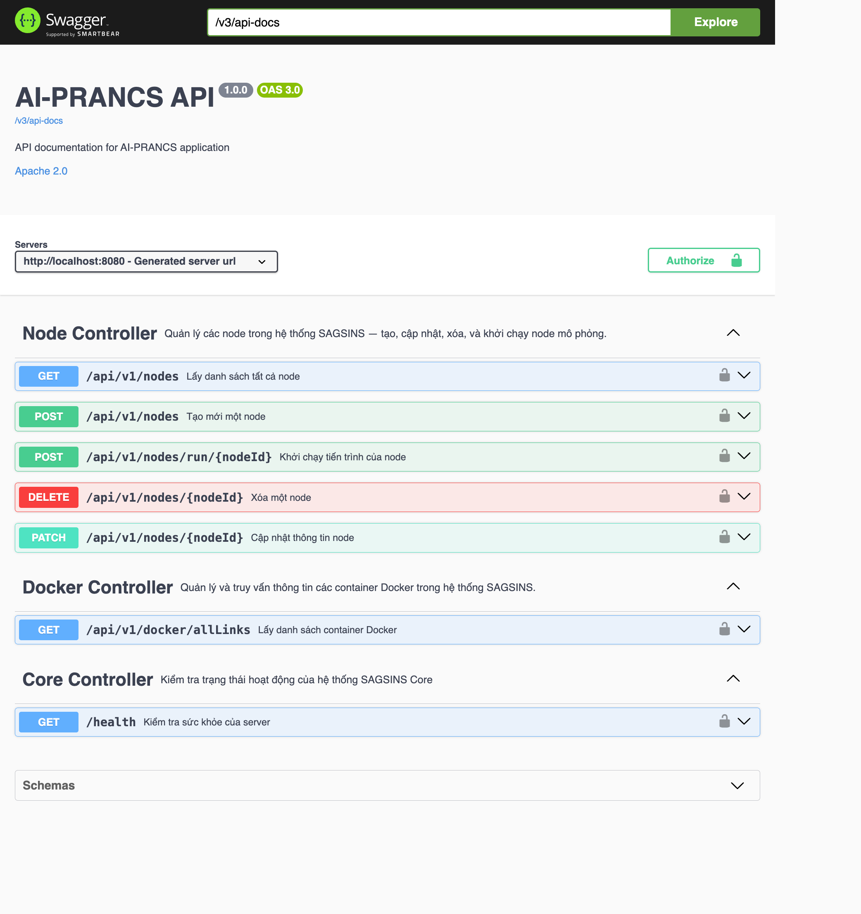
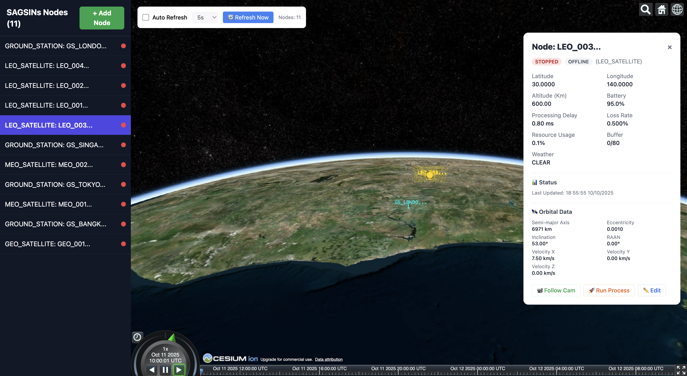
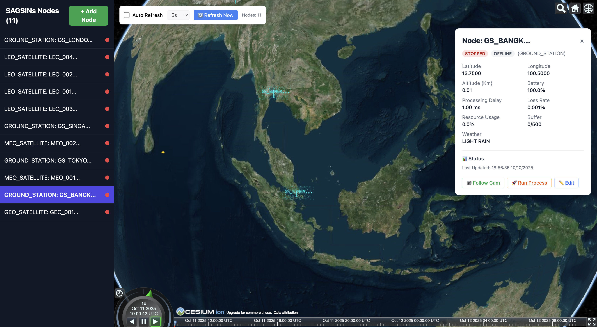
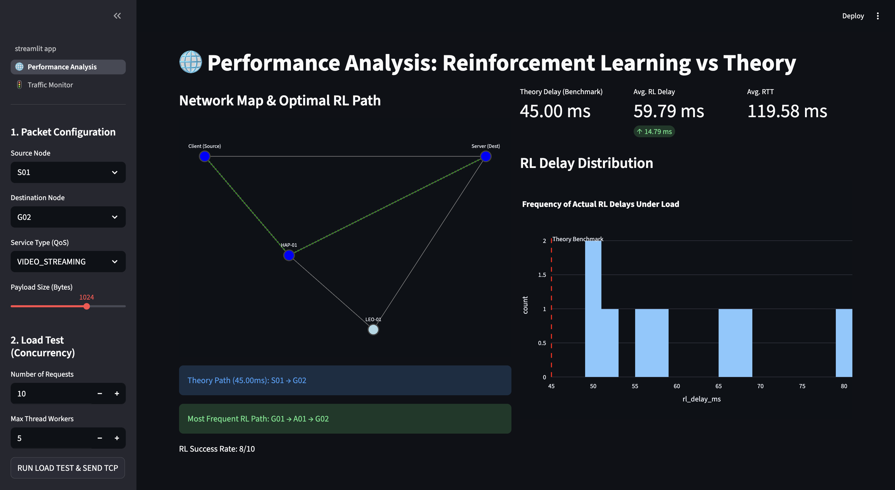

# 🌐 AI-Powered Resource Allocation in Cloud and Network Systems


[](https://streamlit.io/)
[](https://www.python.org/)
[](https://www.tensorflow.org/)
[](https://pytorch.org/)
[](https://www.mongodb.com/)
[](https://www.docker.com/)
[]()
[](LICENSE)

> A **Generative AI-based simulation** for optimizing resource allocation in **Space–Air–Ground–Sea Integrated Networks (SAGSINs)** using **heuristic algorithms** and **reinforcement learning**.
## 📋 Table of Contents

- [Overview](#overview)
- [System Architecture](#system-architecture)
- [Technology Stack](#technology-stack)
- [Getting Started](#getting-started)
- [Project Structure](#project-structure)
- [API Documentation](#api-documentation)
- [Performance Metrics](#performance-metrics)
- [System Requirements](#system-requirements)
- [Troubleshooting](#troubleshooting)
- [Contributing](#contributing)
- [License](#license)
## 🚀 Project Overview
This project focuses on **minimizing communication latency** and **optimizing bandwidth and energy usage** across integrated SAGSIN networks.  
It combines **heuristic algorithms (PSO, ACO)** with **Generative AI** to deliver intelligent resource allocation and real-time adaptability.

**SAGSINS** is an advanced simulation platform for **Space-Air-Ground-Sea Integrated Networks** that enables research and optimization of AI-powered routing algorithms in multi-layered satellite networks (GEO/MEO/LEO).

### Key Features

- **Multi-client simulation** supporting concurrent connections and parallel data flows
- **AI-powered routing** using Reinforcement Learning (RL) algorithms
- **Real-time resource allocation** optimization across satellite networks
- **Comparative analysis** between RL-based and traditional routing (Dijkstra)
- **Dynamic network topology** with support for link disruptions and congestion
- **Comprehensive metrics** for latency, throughput, packet loss, and fairness evaluation

### Primary Applications

- Research on adaptive routing algorithms in satellite networks
- Performance benchmarking of AI vs classical routing methods
- Network resilience testing under various failure scenarios
- Educational demonstrations for distributed systems and space communications

---

## 🏗️ System Architecture

### Overview

The system consists of four interconnected layers designed for scalability and modularity:


### Component Breakdown

| Layer | Components | Responsibilities |
|-------|-----------|------------------|
| **Simulation** | • Multiple Streamlit Clients<br>• Ground Stations | • Generate concurrent data streams<br>• Collect performance metrics<br>• Visualize real-time statistics<br>• Handle multi-threaded connections |
| **Satellite Network** | • LEO Satellites<br>• MEO Satellites<br>• GEO Satellites | • Inter-layer packet forwarding<br>• Dynamic topology updates<br>• Load balancing<br>• State synchronization |
| **AI Routing** | • RL Server<br>• Dijkstra Module | • Deep learning-based route calculation<br>• Traditional routing baseline<br>• Performance comparison<br>• Model training and inference |
| **Management** | • SAGSINS Backend<br>• MongoDB<br>• React UI | • Centralized configuration<br>• Persistent storage<br>• Network monitoring<br>• Administrative interface |

### Multi-Client Data Flow

```
Client A ──┐
Client B ──┼──> Ground Station A ──> LEO Layer ──> MEO Layer ──┐
Client C ──┘                                                    │
                                                                ▼
Client X ──┐                                              GEO Layer
Client Y ──┼──< Ground Station B <── LEO Layer <── MEO Layer ──┘
Client Z ──┘
           │
           └──> WebSocket ACK & Statistics
```

**Key Features:**
- Supports unlimited concurrent clients
- Thread-safe packet handling
- Asynchronous acknowledgment system
- Real-time metric aggregation across all clients

**Screenshots:**


- API / Swagger UI for Backend Services
   
- 3D Map / Node Dashboard (Cesium)
   
- React UI for SAGSINS Management - ASIA
   
- Streamlit — Performance Analysis Dashboard
   

---

## 🛠️ Technology Stack

### Backend Services

| Component | Technology | Version | Purpose |
|-----------|-----------|---------|---------|
| **SAGSINS Backend** | Spring Boot | 2.7+ | Core orchestration service, RESTful APIs |
| **Database** | MongoDB | 4.4+ | Network state, metrics, configuration storage |
| **Message Queue** | RabbitMQ (optional) | 3.9+ | Async communication between services |
| **API Gateway** | Spring Cloud Gateway | 3.1+ | Request routing and load balancing |

### AI & Simulation

| Component | Technology | Version | Purpose |
|-----------|-----------|---------|---------|
| **RL Server** | Python, PyTorch | 3.8+, 2.0+ | Reinforcement learning model training |
| **Simulation Client** | Streamlit | 1.25+ | Multi-threaded client simulation |
| **Network Simulator** | Java | 11+ | Satellite network behavior modeling |

### Frontend & Monitoring

| Component | Technology | Version | Purpose |
|-----------|-----------|---------|---------|
| **Admin UI** | React.js | 18+ | Configuration management interface |
| **Visualization** | D3.js, Recharts | Latest | Real-time metrics visualization |
| **Monitoring** | Prometheus, Grafana | Latest | System performance monitoring |

### Communication Protocols

- **TCP/UDP**: Inter-satellite and client-server communication
- **WebSocket**: Real-time updates and acknowledgments
- **REST**: Management API endpoints
- **gRPC** (optional): High-performance service communication

---

## 🚀 Getting Started

### Prerequisites

```bash
# Check versions
java -version    # Should be 11+
python3 --version # Should be 3.8+
node -version    # Should be 16+
docker --version # Should be 20.10+
```

### 1. Clone Repository

```bash
git clone <repository-url>
cd PBL4
```

### 2. Environment Setup

```bash
# Copy environment template
cp .env.example .env

# Edit configuration
nano .env
```

**Required Environment Variables:**
```properties
MONGODB_URI=mongodb://localhost:27017/sagsins
SPRING_PROFILES_ACTIVE=dev
RL_SERVER_HOST=localhost
RL_SERVER_PORT=5000
```

### 3. Quick Start with Docker Compose

```bash
# Build and start all services
docker-compose up --build

# Start in detached mode
docker-compose up -d

# View logs
docker-compose logs -f sagsins-backend
```

### 4. Manual Service Startup

#### Start SAGSINS Backend (Spring Boot)

```bash
cd src/sagsins-backend
./mvnw clean install
./mvnw spring-boot:run

# Or using JAR
java -jar target/sagsins-backend-1.0.0.jar
```

**Backend will start on:** `http://localhost:8080`

#### Start RL Server

```bash
cd src/SAGINs-DRL-Agent
python3 -m venv .venv
source .venv/bin/activate  # On Windows: .venv\Scripts\activate
pip install -r requirements.txt
python main.py
```

**RL Server will start on:** `http://localhost:5000`

#### Start Simulation Clients (Multiple Instances)

```bash
# Terminal 1 - Client A
cd src/client
python3 -m venv .venv
source .venv/bin/activate
pip install -r requirements.txt
streamlit run streamlit_app.py --server.port 8501

# Terminal 2 - Client B
streamlit run streamlit_app.py --server.port 8502

# Terminal 3 - Client C
streamlit run streamlit_app.py --server.port 8503
```

#### Start React Admin UI

```bash
cd src/sagsins-frontend
npm install
npm start

# Production build
npm run build
```

**Frontend will start on:** `http://localhost:3000`

### 5. Verify Installation

```bash
# Check backend health
curl http://localhost:8080/actuator/health

# Check RL server status
curl http://localhost:5000/health

# Check MongoDB connection
mongosh --eval "db.adminCommand('ping')"
```

---

## 📁 Project Structure

```
PBL4/
├── src/
│   ├── sagsins-backend/              # Spring Boot backend service
│   │   ├── src/main/java/
│   │   │   └── com/sagsins/
│   │   │       ├── controller/       # REST API controllers
│   │   │       ├── service/          # Business logic
│   │   │       ├── model/            # Data models
│   │   │       ├── repository/       # MongoDB repositories
│   │   │       └── config/           # Configuration classes
│   │   ├── src/main/resources/
│   │   │   ├── application.yml       # Spring configuration
│   │   │   └── application-prod.yml
│   │   └── pom.xml
│   │
│   ├── client/                       # Streamlit simulation clients
│   │   ├── streamlit_app.py          # Main client application
│   │   ├── components/               # UI components
│   │   ├── utils/                    # Helper functions
│   │   └── requirements.txt
│   │
│   ├── sagin-network-simulator/      # Java network simulator
│   │   ├── src/main/java/
│   │   │   └── com/simulator/
│   │   │       ├── satellite/        # Satellite models
│   │   │       ├── routing/          # Routing algorithms
│   │   │       └── metrics/          # Performance metrics
│   │   └── pom.xml
│   │
│   ├── SAGINs-DRL-Agent/             # RL agent implementation
│   │   ├── main.py                   # RL server entry point
│   │   ├── agent/                    # RL agent classes
│   │   ├── environment/              # Gym environment
│   │   ├── models/                   # Neural network models
│   │   ├── training/                 # Training scripts
│   │   └── requirements.txt
│   │
│   └── sagsins-frontend/             # React admin UI
│       ├── src/
│       │   ├── components/           # React components
│       │   ├── pages/                # Page components
│       │   ├── services/             # API services
│       │   └── utils/                # Utilities
│       └── package.json
│
├── docs/
│   ├── api/                          # API documentation
│   ├── architecture/                 # Architecture diagrams
│   ├── screenshots/                  # System screenshots
│   └── user-guide/                   # User documentation
│
├── deployment/
│   ├── docker/                       # Dockerfile configurations
│   ├── kubernetes/                   # K8s manifests
│   └── terraform/                    # Infrastructure as code
│
├── scripts/
│   ├── setup.sh                      # Setup script
│   ├── deploy.sh                     # Deployment script
│   └── test.sh                       # Test runner
│
├── docker-compose.yml                # Docker Compose configuration
├── .env.example                      # Environment template
└── README.md
```
---

## 📊 Performance Metrics

The system tracks comprehensive performance indicators:

### Network Metrics
- **Latency**: End-to-end packet delay (ms)
- **Throughput**: Data transmission rate (Mbps)
- **Packet Loss**: Percentage of dropped packets
- **Jitter**: Latency variation (ms)

### Routing Metrics
- **Route Optimality**: Comparison with theoretical optimal
- **Convergence Time**: Time to find stable routes (s)
- **Load Distribution**: Traffic balance across nodes
- **Failover Time**: Recovery time after link failure (s)

### AI Model Metrics
- **Training Accuracy**: Model learning performance
- **Inference Time**: Route calculation speed (ms)
- **Reward Function**: RL agent cumulative reward
- **Exploration Rate**: ε-greedy exploration parameter

### System Metrics
- **CPU Usage**: Per-service resource utilization
- **Memory Usage**: RAM consumption (MB)
- **Active Connections**: Concurrent client count
- **API Response Time**: Backend latency (ms)

---

## 💻 System Requirements

### Minimum Requirements

| Resource | Specification |
|----------|--------------|
| **OS** | Linux (Ubuntu 20.04+), macOS 11+, Windows 10+ |
| **CPU** | 4 cores @ 2.5 GHz |
| **RAM** | 8 GB |
| **Storage** | 20 GB SSD |
| **Network** | 100 Mbps |

### Recommended Requirements

| Resource | Specification |
|----------|--------------|
| **OS** | Linux (Ubuntu 22.04) |
| **CPU** | 8 cores @ 3.0 GHz |
| **RAM** | 16 GB |
| **Storage** | 50 GB NVMe SSD |
| **Network** | 1 Gbps |
| **GPU** | NVIDIA GPU with CUDA 11+ (for RL training) |

### Software Dependencies

```bash
# Core
Java JDK 11+
Python 3.8+
Node.js 16+
Maven 3.6+
npm 8+

# Databases
MongoDB 4.4+

# Containerization
Docker 20.10+
Docker Compose 2.0+

# Optional
RabbitMQ 3.9+
Redis 6.0+
Nginx 1.20+
```

---

## 🔧 Troubleshooting

### Backend Issues

#### Port Already in Use
```bash
# Find process using port 8080
lsof -i :8080
# or
netstat -ano | findstr :8080

# Kill process
kill -9 <PID>  # Linux/macOS
taskkill /PID <PID> /F  # Windows
```

#### MongoDB Connection Failed
```bash
# Check MongoDB is running
docker ps | grep mongo

# Start MongoDB
docker-compose up -d mongodb

# Check connection in application.yml
spring.data.mongodb.uri=mongodb://localhost:27017/sagsins
```

#### Out of Memory Error
```bash
# Increase JVM heap size
export JAVA_OPTS="-Xms512m -Xmx2048m"
./mvnw spring-boot:run
```

### RL Server Issues

#### CUDA Not Available
```bash
# Install PyTorch with CUDA support
pip install torch torchvision torchaudio --index-url https://download.pytorch.org/whl/cu118

# Verify CUDA
python -c "import torch; print(torch.cuda.is_available())"
```

#### Training Convergence Issues
```python
# Adjust hyperparameters in config.yml
learning_rate: 0.0001  # Reduce if unstable
batch_size: 64         # Increase for stability
gamma: 0.99            # Discount factor
epsilon_decay: 0.995   # Exploration decay rate
```

### Client Issues

#### Streamlit Port Conflict
```bash
# Start on different port
streamlit run streamlit_app.py --server.port 8502
```

#### WebSocket Connection Failed
```bash
# Check backend WebSocket endpoint
curl -i -N -H "Connection: Upgrade" \
  -H "Upgrade: websocket" \
  http://localhost:8080/ws/simulation
```

### Docker Issues

#### Container Keeps Restarting
```bash
# Check logs
docker-compose logs sagsins-backend

# Restart specific service
docker-compose restart sagsins-backend

# Rebuild without cache
docker-compose build --no-cache
```

#### Volume Permission Denied
```bash
# Fix permissions
sudo chown -R $USER:$USER ./data

# Or run with proper user
docker-compose run --user $(id -u):$(id -g) sagsins-backend
```

---

## 🤝 Contributing

We welcome contributions from the community!

### Development Workflow

1. **Fork** the repository
2. **Create** a feature branch
   ```bash
   git checkout -b feature/amazing-feature
   ```
3. **Make** your changes
4. **Test** thoroughly
   ```bash
   # Run backend tests
   cd src/sagsins-backend
   ./mvnw test
   
   # Run Python tests
   cd src/SAGINs-DRL-Agent
   pytest
   ```
5. **Commit** with conventional commits
   ```bash
   git commit -m "feat: add amazing feature"
   ```
6. **Push** to your fork
   ```bash
   git push origin feature/amazing-feature
   ```
7. **Create** a Pull Request

### Coding Standards

**Java (Backend)**
- Follow Google Java Style Guide
- Use Lombok for boilerplate reduction
- Write Javadoc for public APIs
- Maintain 80%+ test coverage

**Python (RL/Client)**
- Follow PEP 8 style guide
- Use type hints
- Write docstrings (Google style)
- Format with Black

**JavaScript (Frontend)**
- Follow Airbnb JavaScript Style Guide
- Use ESLint and Prettier
- Write PropTypes for components
- Maintain component documentation

### Commit Message Convention

```
<type>(<scope>): <subject>

<body>

<footer>
```

**Types:**
- `feat`: New feature
- `fix`: Bug fix
- `docs`: Documentation changes
- `style`: Code style changes
- `refactor`: Code refactoring
- `test`: Test additions/changes
- `chore`: Build process or auxiliary tool changes

---

## 📝 License

This project is currently **unlicensed**. 

For licensing inquiries, please open an issue to discuss adding:
- MIT License
- Apache License 2.0
- GNU GPLv3
- Or custom licensing terms

---

## 🎯 Roadmap

### Phase 1: Core Features 
- [x] Multi-client simulation support
- [x] Basic RL routing implementation
- [x] Spring Boot backend API
- [x] MongoDB integration
- [x] Streamlit multi-threaded clients
- [x] Real-time metrics collection
- [x] WebSocket communication
- [x] Basic Dijkstra routing baseline
- [x] React UI for management
- [x] Core SAGSINs simulation engine
- [ ] Comprehensive unit test suite
- [ ] CI/CD pipeline setup

### Phase 2: Advanced Features
- [ ] Advanced RL algorithms (A3C, PPO)
- [ ] Real-time network visualization
- [ ] Distributed training support
- [ ] Performance optimization
- [ ] Load testing framework

---

**Project Status**: Active Development  
**Last Updated**: October 2025  
**Version**: 1.0.0-beta
