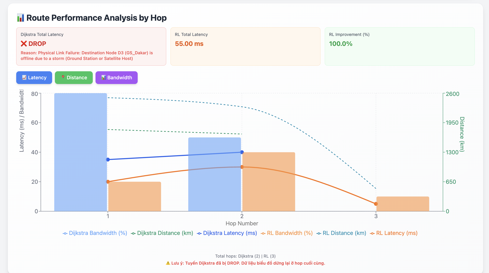

# 🌐 AI-Powered Resource Allocation in Cloud and Network Systems


[](https://streamlit.io/)
[](https://www.python.org/)
[](https://www.tensorflow.org/)
[](https://pytorch.org/)
[](https://www.mongodb.com/)
[](https://www.docker.com/)

> A **Generative AI-based simulation** for optimizing resource allocation in **Space–Air–Ground–Sea Integrated Networks (SAGSINs)** using **heuristic algorithms** and **reinforcement learning**.

---

## 📋 Table of Contents

### 1. [Overview](#1-overview)
- 1.1 [Project Description](#11-project-description)
- 1.2 [Key Features](#12-key-features)
- 1.3 [Applications](#13-applications)

### 2. [Architecture](#2-architecture)
- 2.1 [System Design](#21-system-design)
- 2.2 [Components](#22-components-breakdown)
- 2.3 [Data Flow](#23-multi-client-data-flow)

### 3. [Technology Stack](#3-technology-stack)

### 4. [Getting Started](#4-getting-started)
- 4.1 [Prerequisites](#41-prerequisites)
- 4.2 [Installation](#42-installation)
- 4.3 [Configuration](#43-configuration)

### 5. [Project Structure](#5-project-structure)

### 6. [Usage](#6-usage)
- 6.1 [Running Simulations](#61-running-simulations)
- 6.2 [API Endpoints](#62-api-endpoints)

### 7. [Performance Metrics](#7-performance-metrics)

### 8. [System Requirements](#8-system-requirements)

### 9. [Troubleshooting](#9-troubleshooting)

### 10. [Contributing](#10-contributing)

### 11. [Roadmap](#11-roadmap)

### 12. [License](#12-license)

---

## 1. Overview

### 1.1 Project Description

**SAGSINS** is an advanced simulation platform for **Space-Air-Ground-Sea Integrated Networks** that enables research and optimization of AI-powered routing algorithms in multi-layered satellite networks (GEO/MEO/LEO).

### 1.2 Key Features

- Multi-client simulation with concurrent connections
- AI-powered routing using Reinforcement Learning
- Real-time resource allocation optimization
- Comparative analysis (RL vs Dijkstra)
- Dynamic network topology with fault tolerance
- Comprehensive performance metrics
- **Diverse simulation scenarios** (Weather Events, Node Overload, Traffic Spikes, etc.)
- **Real-time scenario management** via UI and REST API

### 1.3 Applications

- Research on adaptive routing algorithms
- Performance benchmarking of AI vs classical methods
- Network resilience testing
- Educational demonstrations for distributed systems

---

## 2. Architecture

### 2.1 System Design


### 2.2 Components Breakdown

| Layer | Components | Responsibilities |
|-------|-----------|------------------|
| **Simulation** | • Multiple Streamlit Clients<br>• Ground Stations | • Generate concurrent data streams<br>• Collect performance metrics<br>• Visualize real-time statistics<br>• Handle multi-threaded connections |
| **Satellite Network** | • LEO Satellites<br>• MEO Satellites<br>• GEO Satellites | • Inter-layer packet forwarding<br>• Dynamic topology updates<br>• Load balancing<br>• State synchronization |
| **AI Routing** | • RL Server<br>• Dijkstra Module | • Deep learning-based route calculation<br>• Traditional routing baseline<br>• Performance comparison<br>• Model training and inference |
| **Management** | • SAGSINS Backend<br>• MongoDB<br>• React UI | • Centralized configuration<br>• Persistent storage<br>• Network monitoring<br>• Administrative interface |

### 2.3 Multi-Client Data Flow

```
Client A ──┐
Client B ──┼──> Ground Station A ──> LEO Layer ──> MEO Layer ──┐
Client C ──┘                                                    │
                                                                ▼
Client X ──┐                                              GEO Layer
Client Y ──┼──< Ground Station B <── LEO Layer <── MEO Layer ──┘
Client Z ──┘
           │
           └──> WebSocket ACK & Statistics
```


### Screenshots:
**a. Satellite Network Topology Visualization :**

  **b. React UI for SAGSINS Management — Asia Region Overview :**


**c. Model Performance and Network Efficiency**


**d. Graphical Representation of Packet Routing Paths**


**e. Comparative Analysis of Routing Algorithms**



**f. Batch Simulation Results Dashboard**


---

## 3. Technology Stack

| Category | Technologies |
|----------|-------------|
| **Backend** | Java 11+, Spring Boot 3.1+ |
| **AI/ML** | Python 3.8+, PyTorch 2.0+, TensorFlow 2.13+ |
| **Frontend** | React 18+, Streamlit 1.25+ |
| **Database** | MongoDB 4.4+ |
| **DevOps** | Docker, Docker Compose |
| **Protocols** | TCP/UDP, WebSocket, REST API |

---

## 4. Getting Started

### 4.1 Prerequisites

```bash
java -version    # 11+
python3 --version # 3.8+
node -version    # 16+
docker --version # 20.10+
```

### 4.2 Installation

**Quick Start (Docker):**
```bash
git clone <repository-url>
cd PBL4
docker-compose up --build
```

**Manual Setup:**

```bash
# 1. Clone repository
git clone <repository-url>
cd PBL4

# 2. Start MongoDB
docker run -d -p 27017:27017 --name mongodb mongo:4.4

# 3. Start Backend
cd src/sagsins-backend
./mvnw spring-boot:run

# 4. Start RL Server
cd src/SAGINs-DRL-Agent
python3 -m venv .venv
source .venv/bin/activate
pip install -r requirements.txt
python main.py

# 5. Start Client
cd src/client
streamlit run streamlit_app.py --server.port 8501

# 6. Start Frontend
cd src/sagsins-frontend
npm install && npm start
```

### 4.3 Configuration

**Environment Variables (.env):**
```properties
MONGODB_URI=mongodb://localhost:27017/sagsins
SERVER_PORT=8080
RL_SERVER_HOST=localhost
RL_SERVER_PORT=5000
```

**Verify Installation:**
```bash
curl http://localhost:8080/actuator/health
curl http://localhost:5000/health
```

---

## 5. Project Structure

```
PBL4/
├── src/
│   ├── sagsins-backend/           # Spring Boot API
│   ├── client/                    # Streamlit simulation clients
│   ├── sagin-network-simulator/   # Network simulator
│   ├── SAGINs-DRL-Agent/          # RL agent
│   └── sagsins-frontend/          # React admin UI
├── docs/                          # Documentation & screenshots
├── deployment/                    # Docker, K8s configs
├── scripts/                       # Automation scripts
├── docker-compose.yml
└── README.md
```

---

## 6. Usage

### 6.1 Running Simulations

1. Access Streamlit client: `http://localhost:8501`
2. Configure parameters (routing algorithm, packet size, rate)
3. Select source and destination
4. Click "Start Simulation"
5. Monitor real-time metrics

### 6.2 Simulation Scenarios

The platform supports diverse simulation scenarios to test network behavior under different conditions:

- **Normal**: Standard operation (default)
- **Weather Event**: Bad weather affecting signal quality
- **Node Overload**: High load and queue congestion
- **Node Offline**: Temporary node failures
- **Traffic Spike**: Burst traffic scenarios
- **TTL Expired**: Packet lifetime management

**Access scenarios via:**
- Frontend UI: Monitor page → Scenario Selector dropdown
- REST API: `POST /api/simulation/scenario/{scenarioName}`

📖 **Detailed Guide**: See [Simulation Scenarios Documentation](docs/SIMULATION_SCENARIOS.md)

### 6.3 API Endpoints

API documentation for AI-PRANCS application
```
http://localhost:8080/swagger-ui/index.html
```
***Swagger UI :***


---

## 7. Performance Metrics

| Category | Metrics | Target |
|----------|---------|--------|
| **Network** | Latency, Throughput, Packet Loss, Jitter | < 100ms, > 50 Mbps, < 1%, < 20ms |
| **Routing** | Optimality, Convergence Time, Load Balance | > 95%, < 5s, σ < 0.2 |
| **AI Model** | Accuracy, Inference Time, Reward | > 90%, < 50ms, Increasing |
| **System** | CPU, Memory, Connections, API Latency | < 70%, < 2GB, > 0, < 100ms |

---

## 8. System Requirements

**Minimum:**
- OS: Ubuntu 20.04+ / macOS 11+ / Windows 10+
- CPU: 4 cores @ 2.5 GHz
- RAM: 8 GB
- Storage: 20 GB SSD

**Recommended:**
- OS: Ubuntu 22.04 LTS
- CPU: 8 cores @ 3.0 GHz
- RAM: 16 GB
- Storage: 50 GB NVMe SSD
- GPU: NVIDIA with CUDA 11.8+ (optional)

---

## 9. Troubleshooting

| Issue | Solution |
|-------|----------|
| **Port in use** | `lsof -i :8080` → `kill -9 <PID>` |
| **MongoDB connection failed** | Check `docker ps \| grep mongo` and restart |
| **CUDA not available** | Install PyTorch with CUDA: `pip install torch --index-url https://download.pytorch.org/whl/cu118` |
| **Out of memory** | Increase JVM heap: `export JAVA_OPTS="-Xmx2048m"` |

---

## 10. Contributing

1. Fork the repository
2. Create feature branch: `git checkout -b feature/name`
3. Commit changes: `git commit -m "feat: description"`
4. Push to branch: `git push origin feature/name`
5. Open Pull Request

**Coding Standards:**
- Java: Google Java Style Guide
- Python: PEP 8
- JavaScript: Airbnb Style Guide

---

## 11. Roadmap

### ✅ Phase 1: Core Features (Completed)
- Multi-client simulation
- Basic RL routing
- Spring Boot backend
- MongoDB integration
- Real-time metrics
- React UI

### 🚧 Phase 2: Advanced Features (In Progress)
- [ ] Advanced RL algorithms (A3C, PPO)
- [ ] Real-time visualization
- [ ] Comprehensive test suite
- [ ] CI/CD pipeline
- [ ] Performance optimization

### 📋 Phase 3: Enterprise Features (Planned)
- [ ] Distributed training
- [ ] Multi-region support
- [ ] Advanced monitoring (Grafana)
- [ ] Load testing framework

---

## 12. License

This project is currently under **MIT License**
---

**Project Status:** Active Development  
**Version:** 1.0.0-beta  
**Last Updated:** October 20